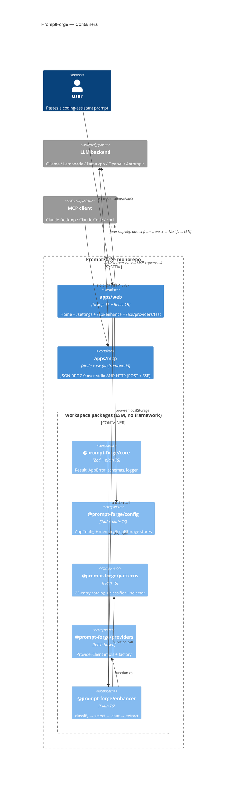
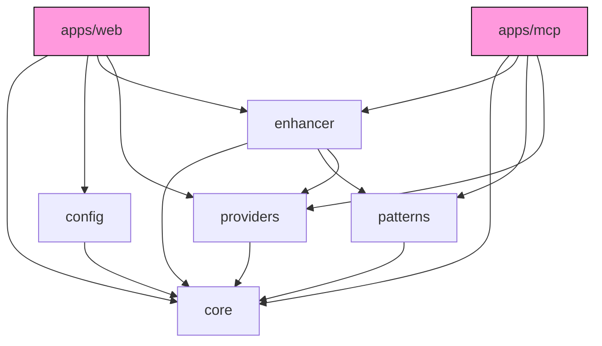
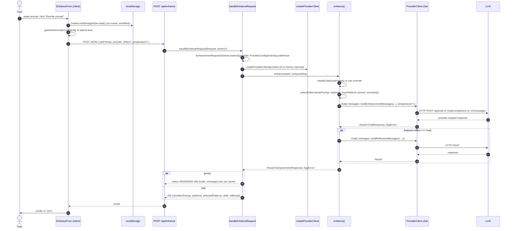
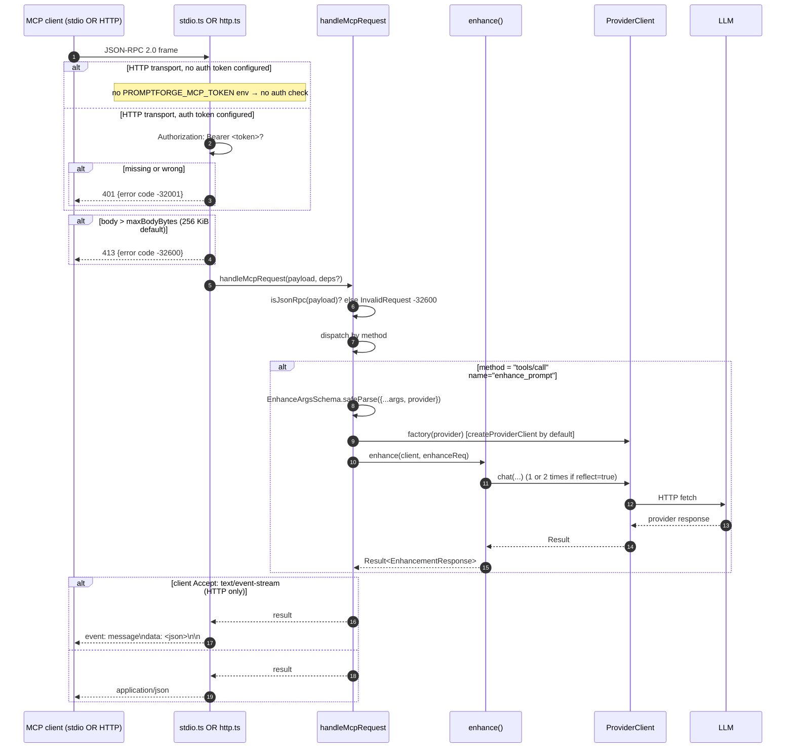

# ARCHITECTURE

What the code actually does. Every claim cites file:line. Read this before trusting `docs/`.

## C4 — Container view



## Module boundaries (the real graph from code, not from docs)



Evidence (every arrow is a real `import` statement):

- `apps/web/src/app/api/enhance/handler.ts:1-7` imports core + enhancer + providers; `apps/web/src/components/enhance-form.tsx:3-8` imports config + core; `apps/web/src/components/provider-settings.tsx:3-12` imports config + core + providers. **No web file imports `@prompt-forge/patterns`** (verified by `grep -rn "@prompt-forge/patterns" apps/web/src`). The package.json dep at `apps/web/package.json:17` and the `transpilePackages` entry at `apps/web/next.config.mjs:12` are unused.
- `apps/mcp/src/server.ts:1-9` imports core, enhancer, patterns, providers.
- `packages/enhancer/src/enhance.ts:1-12` imports core + patterns + providers.
- `packages/config/src/store.ts:12` imports zod; the file also uses core symbols (verified directly).
- `packages/patterns/src/*.ts:1` all import types from core only.
- `packages/providers/src/*.ts:1` all import core; `factory.ts:1-6` is the only file that imports peer modules within the package.
- `packages/core/src/*.ts` imports zod only (`packages/core/src/types.ts:1`). No cross-package imports.

`docs/architecture.md:36-53` draws `web → patterns`. The code does not. See `DRIFT.md` item D-02.

## Request flow — Web → `/api/enhance` → LLM



Citations:
- Form hydration: `apps/web/src/components/enhance-form.tsx:23-30` (`useEffect → createLocalStorageStore`).
- Submit-time active read: `apps/web/src/components/enhance-form.tsx:48-58`.
- Validation: `apps/web/src/app/api/enhance/handler.ts:10-25`.
- Cause stripped from error envelope: `apps/web/src/app/api/enhance/handler.ts:39-46` (destructures `{ code, message }` only).
- Pipeline: `packages/enhancer/src/enhance.ts:19-74`.

## Request flow — MCP `tools/call enhance_prompt`



Citations:
- HTTP auth gate: `apps/mcp/src/http.ts:147-163`.
- Body-size gate: `apps/mcp/src/http.ts:42-52` (read) + `apps/mcp/src/http.ts:167-178` (response).
- SSE on POST: `apps/mcp/src/http.ts:212-223`.
- GET SSE channel: `apps/mcp/src/http.ts:106-141`.
- JSON-RPC dispatch: `apps/mcp/src/server.ts:112-224`.
- `tools/call enhance_prompt`: `apps/mcp/src/server.ts:141-175`.
- `resources/list`: `apps/mcp/src/server.ts:177-186`.
- `resources/read`: `apps/mcp/src/server.ts:188-212`.

## Module reference

### `@prompt-forge/core` — `packages/core/src/`

| Export | File:line |
| --- | --- |
| `Result<T,E>`, `ok`, `err`, `isOk`, `isErr`, `map`, `flatMap`, `mapErr`, `unwrapOr`, `fromThrowable` | `result.ts:1-36` |
| `AppError`, `AppErrorCode`, `appError` | `error.ts:1-29` |
| `ProviderKind`, `ProviderKindSchema`, `ProviderConfig`, `ProviderConfigSchema` | `types.ts:3-35` |
| `ChatRole`, `ChatMessage`, `ChatRequest`, `ChatRequestSchema`, `ChatResponse`, `ChatResponseSchema` | `types.ts:37-63` |
| `TaskKind`, `TaskKindSchema`, `PatternCategory`, `Pattern`, `PatternSchema` | `types.ts:65-96` |
| `EnhancementRequest`, `EnhancementRequestSchema`, `EnhancementResponse`, `EnhancementResponseSchema` | `types.ts:98-117` |
| `createLogger(scope, bindings?)` returning `{info, warn, error, debug, child}` with deep redaction of `apiKey`/`Authorization`/`token`/`password` | `logger.ts:58-…` |

Runtime dep: `zod` (`packages/core/package.json:16`).

### `@prompt-forge/config` — `packages/config/src/`

| Export | File:line |
| --- | --- |
| `AppConfigSchema`, `AppConfig` | `store.ts` |
| `emptyAppConfig()` | `store.ts` |
| `createMemoryStore(initial?)`, `createLocalStorageStore(storage, key?)` | `store.ts` |
| `upsertProvider`, `removeProvider`, `setActiveProvider`, `getActiveProviderConfig` | `store.ts` |

LocalStorage key: `"promptforge:config"` (verified by the agent that built it; seeded into e2e at `apps/web/e2e/enhance.spec.ts:14`).

### `@prompt-forge/patterns` — `packages/patterns/src/`

| Export | File:line |
| --- | --- |
| `PATTERN_CATALOG: readonly Pattern[]` (22 entries) | `catalog.ts:3-…` |
| `findPatternBySlug(slug)` | `catalog.ts` |
| `allPatterns()` | `catalog.ts` |
| `classifyTask(rawPrompt) → TaskKind` (rule-weighted) | `classify.ts` |
| `selectPatterns(rawPrompt, taskKind, opts)` | `select.ts` |

Catalog count verified by `grep -c "^\\s*slug:" packages/patterns/src/catalog.ts` → 22 entries before the helper functions.

### `@prompt-forge/providers` — `packages/providers/src/`

| Export | File:line |
| --- | --- |
| `ProviderClient` (the interface every client conforms to) | `client.ts:3-5` |
| `requestJson`, `FetchImpl` | `http.ts:7-…` |
| `createOllamaClient(config, fetchImpl?)` — native `/api/chat` | `ollama.ts` |
| `createOpenAICompatibleClient(config, opts?)` — handles `openai`/`lemonade`/`llamacpp` | `openai-compatible.ts` |
| `createAnthropicClient(config, fetchImpl?)` — native `/v1/messages` | `anthropic.ts` |
| `createProviderClient(config, opts?)` (factory; exhaustive switch by kind) | `factory.ts:18-32` |
| `DEFAULT_BASE_URLS` | `factory.ts:8-14` |
| `scriptedFetch(responder)`, `jsonResponse` (test fixtures) | `test-fixtures.ts` |

Factory routing:
- `ollama` → `createOllamaClient` (`factory.ts:23-24`)
- `lemonade` | `llamacpp` | `openai` → `createOpenAICompatibleClient` (`factory.ts:25-28`)
- `anthropic` → `createAnthropicClient` (`factory.ts:29-30`)

Test command excludes live tests by default: `packages/providers/package.json:12` (`vitest run --exclude src/live.test.ts`). Live tests: `package.json:13` (`test:live`).

### `@prompt-forge/enhancer` — `packages/enhancer/src/`

| Export | File:line |
| --- | --- |
| `enhance(client, request)` — runs the pipeline | `enhance.ts:19-74` |
| `buildEnhancementMessages(args)` | `prompt-builder.ts` |
| `buildReflectionMessages(args)` | `prompt-builder.ts` |
| `extractRewrittenPrompt(raw)` — handles ` ```prompt `, plain ` ``` `, no-fence | `prompt-builder.ts` |

Temperature forwarding to both draft + reflection chat calls: `enhance.ts:41` and `enhance.ts:56`.

### `apps/mcp`

| Surface | File:line |
| --- | --- |
| JSON-RPC handler | `src/server.ts:112-224` |
| Tool: `enhance_prompt` (only tool) | `src/server.ts:51-87` (schema), `141-175` (call) |
| MCP capabilities advertised | `src/server.ts:127` → `{ tools: {}, resources: {} }` |
| stdio transport | `src/stdio.ts:11-39` |
| HTTP transport (POST JSON + POST SSE + GET SSE) | `src/http.ts:81-240` |
| CORS preflight + every-response allow-origin | `src/http.ts:96-104, 224` |
| Body size limit (256 KiB default, configurable via `maxBodyBytes`) | `src/http.ts:19, 42-52, 167-178` |
| Bearer auth (env-gated by `PROMPTFORGE_MCP_TOKEN`) | `src/http.ts:113-124` (GET), `src/http.ts:147-163` (POST) |
| Bind address | `src/http.ts:228` (default `127.0.0.1`); env override at `src/http.ts:246` |
| SSE keep-alive | `src/http.ts:135-139` (default 15 s, override via `sseKeepAliveMs`) |
| Bin shims (spawn tsx) | `bin/stdio.mjs`, `bin/http.mjs` |

stdio does NOT support auth (`src/stdio.ts` has no token check). That is intentional — stdio inherits the local user's process trust boundary.

### `apps/web`

| Route | File:line |
| --- | --- |
| `GET /` (server component) | `src/app/page.tsx` |
| `GET /settings` (server component) | `src/app/settings/page.tsx` |
| `POST /api/enhance` | `src/app/api/enhance/route.ts` → `src/app/api/enhance/handler.ts:30-…` |
| `POST /api/providers/test` | `src/app/api/providers/test/route.ts` → `src/app/api/providers/test/handler.ts` |
| Layout + Home/Settings nav | `src/app/layout.tsx` |
| Client component `<EnhanceForm>` | `src/components/enhance-form.tsx` |
| Client component `<ProviderSettings>` | `src/components/provider-settings.tsx` |

Error status mapping in `/api/enhance`:
- `PROVIDER_UNREACHABLE` or `PROVIDER_TIMEOUT` → 502
- `VALIDATION` → 400
- everything else → 500
- file: `apps/web/src/app/api/enhance/handler.ts:32-46`

Same mapping in `/api/providers/test`: `apps/web/src/app/api/providers/test/handler.ts`. Both strip `cause` before serialization.

## External dependencies (real)

| Dep | Used by (callsite) | Purpose |
| --- | --- | --- |
| `zod` | `packages/core/src/types.ts:1`, `packages/config/src/store.ts:12`, `apps/mcp/src/server.ts:10`, `apps/web/src/app/api/*/handler.ts` | Runtime validation at every trust boundary |
| `next`, `react`, `react-dom` | `apps/web` only | UI |
| `node:http`, `node:url` | `apps/mcp/src/http.ts:1,242` | HTTP transport |
| `node:readline`, `node:stream`, `node:url` | `apps/mcp/src/stdio.ts:1-2,41` | stdio transport |
| `tsx` | `apps/mcp/package.json:23`, `apps/mcp/bin/*.mjs` | Run TS sources without prebuild |
| `vitest` | every package | Unit/integration tests |
| `@playwright/test` | `apps/web/playwright.config.ts`, `apps/web/e2e/*.spec.ts` | E2E tests |
| `@testing-library/react`, `@testing-library/dom`, `@testing-library/jest-dom`, `happy-dom` | `apps/web/src/components/*.test.tsx` | RTL component tests |
| `@biomejs/biome` | root `package.json:17` | Lint/format |

No HTTP client lib (uses native `fetch`). No bunch of UI libs (no Tailwind, no shadcn, no Zustand — see `DRIFT.md`).

## Trust boundaries

| Boundary | Validation | File:line |
| --- | --- | --- |
| Browser → `/api/enhance` | Zod `EnhancementRequestSchema.extend({provider: ProviderConfigSchema})` | `apps/web/src/app/api/enhance/handler.ts:10` |
| Browser → `/api/providers/test` | Zod `{ provider: ProviderConfigSchema }` | `apps/web/src/app/api/providers/test/handler.ts:5` |
| MCP client → handler (any transport) | `isJsonRpc` guard, then per-method Zod schemas | `apps/mcp/src/server.ts:106-110` and `141-175` |
| HTTP transport → handler | body size 256 KiB, optional bearer auth, JSON.parse | `apps/mcp/src/http.ts:42-52, 113-124, 147-163, 190-201` |
| Provider response → caller | `Result<ChatResponse, AppError>`; non-JSON content-type → `PROVIDER_BAD_RESPONSE`; missing content → `PROVIDER_BAD_RESPONSE` | `packages/providers/src/http.ts`, each client's response parser |
| Browser localStorage → app | `AppConfigSchema.safeParse` on load; `CONFIG_INVALID` on corrupt | `packages/config/src/store.ts` |
| LLM output → user | rendered as `<pre>` text only; never `dangerouslySetInnerHTML` | `apps/web/src/components/enhance-form.tsx` |

API keys do NOT live server-side. The web app posts them in the request body from the user's localStorage to its own `/api/enhance` route, which forwards them to the LLM. MCP transport accepts them in the per-call `provider.apiKey` argument. No env-side API key support in the enhancer pipeline today.

## What runs and how

| Process | Entry | Default port | Auth |
| --- | --- | --- | --- |
| Web (dev) | `make dev` → `next dev -p 3000` | 3000 | none |
| Web (prod) | `make build` then `next start -p 3000` | 3000 | none |
| MCP HTTP | `make dev-mcp-http` → `tsx apps/mcp/src/http.ts` | 8787, `127.0.0.1` | Bearer if `PROMPTFORGE_MCP_TOKEN` is set; else open |
| MCP stdio | `make dev-mcp-stdio` → `tsx apps/mcp/src/stdio.ts` | n/a | inherits process trust |
| MCP HTTP bin | `node apps/mcp/bin/http.mjs` | same | same |
| MCP stdio bin | `node apps/mcp/bin/stdio.mjs` | n/a | same |

## Test layout (real)

| Layer | Files | Count |
| --- | --- | --- |
| core unit | `packages/core/src/{result,error,types,logger}.test.ts` | 39 |
| config unit | `packages/config/src/store.test.ts` | 20 |
| patterns unit | `packages/patterns/src/{catalog,classify,select}.test.ts` | 24 |
| providers unit | `packages/providers/src/{anthropic,factory,http,ollama,openai-compatible}.test.ts` | 30 |
| providers live (env-gated) | `packages/providers/src/live.test.ts` | 3 (skipped by default) |
| enhancer unit | `packages/enhancer/src/{enhance,prompt-builder}.test.ts` | 14 |
| mcp transport + handler | `apps/mcp/src/{server,http,stdio}.test.ts` | 33 |
| web route + RTL | `apps/web/src/app/api/**/*.test.ts`, `apps/web/src/components/*.test.tsx` | 18 |
| e2e (Playwright) | `apps/web/e2e/enhance.spec.ts` | 4 |

Vitest aggregate: 178. Playwright: 4. Live tests run only with `LIVE_OLLAMA=1` / `LIVE_OPENAI=1` / `LIVE_ANTHROPIC=1`.

## Repo layout (actual)

```
.
├── apps/
│   ├── mcp/        JSON-RPC 2.0 server. stdio (src/stdio.ts) + HTTP (src/http.ts).
│   │              Tool: enhance_prompt. Resources: 22 patterns. Bin shims spawn tsx.
│   └── web/        Next.js 15 App Router. /, /settings, /api/enhance, /api/providers/test.
├── packages/
│   ├── config/     AppConfigSchema, memory + localStorage stores, pure helpers
│   ├── core/       Result, AppError, Zod schemas, logger
│   ├── enhancer/   classify → select → chat → (optional reflect) → extract
│   ├── patterns/   22 entries + classifier + selector
│   └── providers/  ProviderClient + ollama + openai-compat + anthropic + factory + live tests
├── docs/           Architecture/packages/providers/patterns/tdd-strategy/development (out of date — see DRIFT.md)
├── scripts/
│   └── audit.mjs   Drift detector — generates DRIFT.md
├── .claude/
│   ├── commands/audit.md       Slash command: /audit
│   └── settings.json           PostToolUse hook re-runs audit after git commit
├── .github/workflows/ci.yml
├── Makefile
├── biome.json
├── tsconfig.base.json
├── pnpm-workspace.yaml
└── package.json
```
