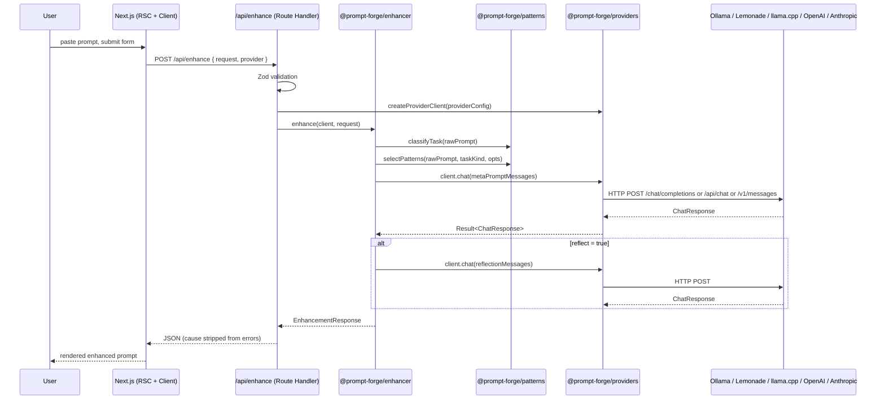
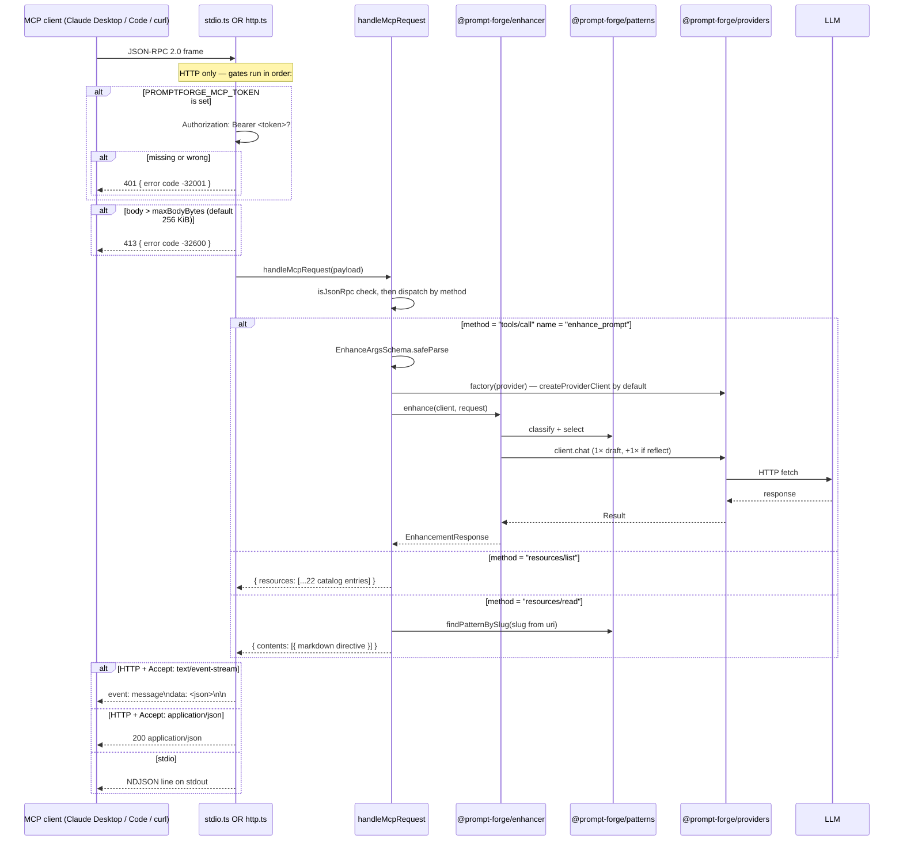
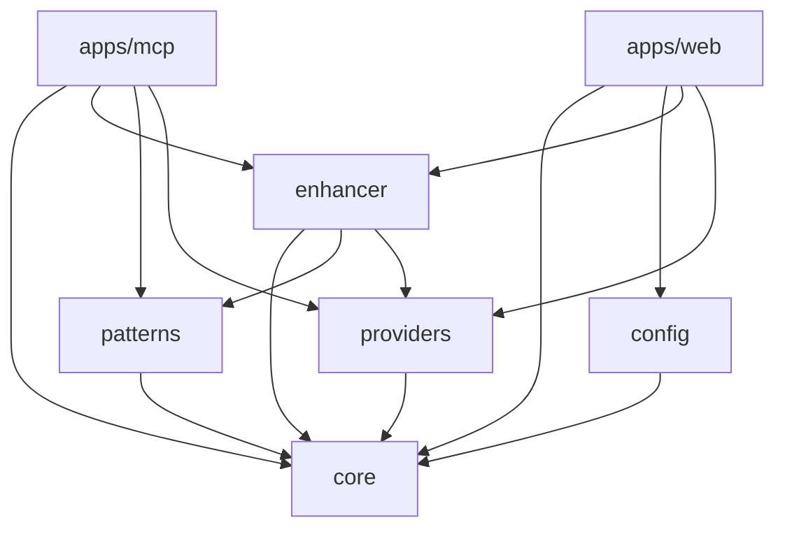

# Architecture

> Authoritative version: `ARCHITECTURE.md` at the repo root. That file cites file:line for every claim. This document is the prose overview.

## Request flow — Web

## Request flow — MCP

GET `/mcp` opens an SSE channel separately for server → client notifications (`apps/mcp/src/http.ts:106-141`); the current server uses it only for keep-alives.

## Dependency graph

`core` is the only package no other package depends on for its own dependencies — every other package imports types and the `Result` helpers from it. `apps/web` does **not** import `patterns` directly; the enhancer is the only caller of the pattern catalog from the web surface. `apps/mcp` imports `patterns` directly because `resources/list` and `resources/read` enumerate the catalog without going through the enhancer.

## Why this shape

The split between `patterns`, `providers`, and `enhancer` exists so that:

- The pattern catalog can be edited without touching any IO code.
- A new provider (Together, Fireworks, Groq, Mistral La Plateforme) is added by writing a single `ProviderClient` implementation, not by modifying the enhancer.
- The enhancer is one pure orchestration function that takes a `ProviderClient` and a request — it has no opinion on where the LLM lives.
- The web app is the only package that depends on Next.js and React. The packages compile to ESM and have no framework-specific code, so they could be reused from a CLI, a server-side worker, or a different frontend.

## Trust boundaries

| Boundary               | Trust level | Notes                                                  |
| ---------------------- | ----------- | ------------------------------------------------------ |
| Browser localStorage   | Untrusted (user-owned, but persists) | API keys live here. Never sent except to the matching provider on submit. |
| Browser → /api/enhance | Server validates with Zod | Schema gates protect against malformed payloads.       |
| /api/enhance → LLM     | Trusted egress | Only the configured `baseUrl` is contacted.            |
| LLM response → user    | Untrusted text | Rendered as `pre`/text only — never `dangerouslySetInnerHTML`. |

The `Dual LLM Pattern` in our catalog is the conceptual basis for this — the enhancer treats LLM output as data, never as control flow.
